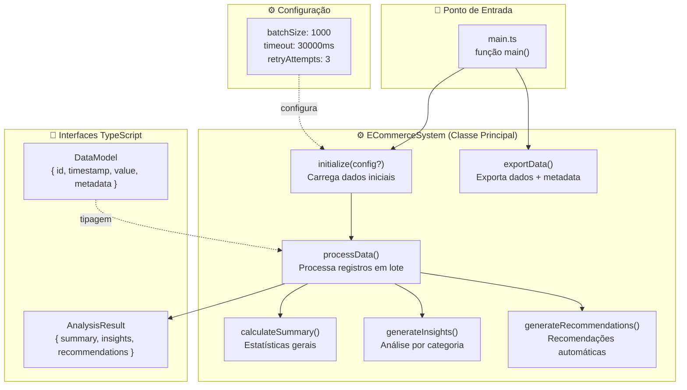
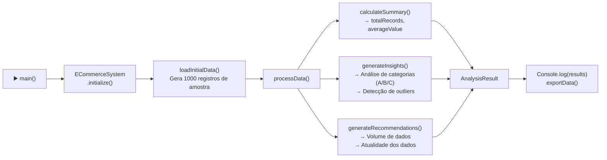
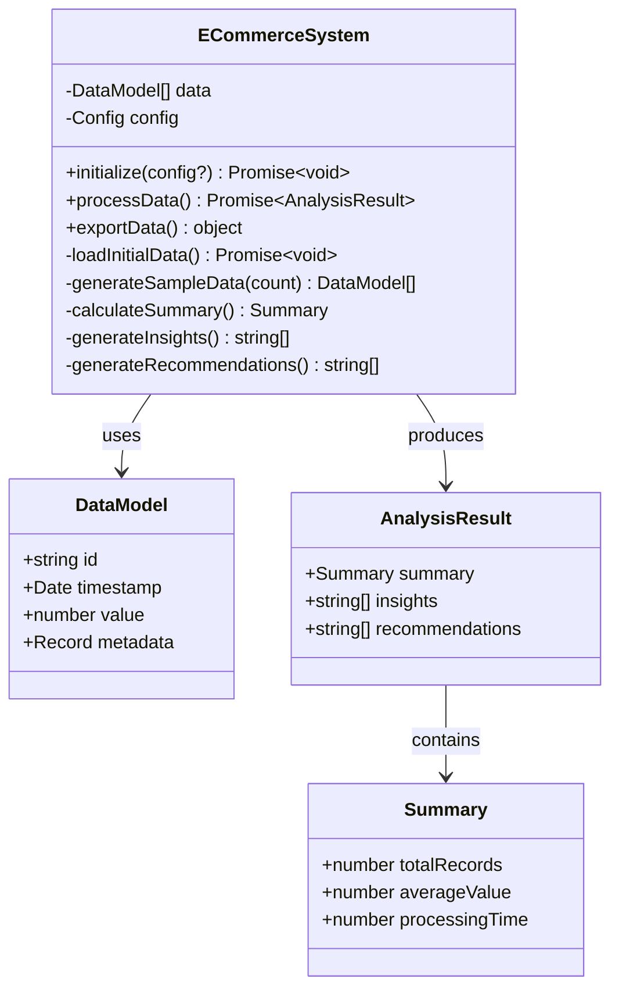
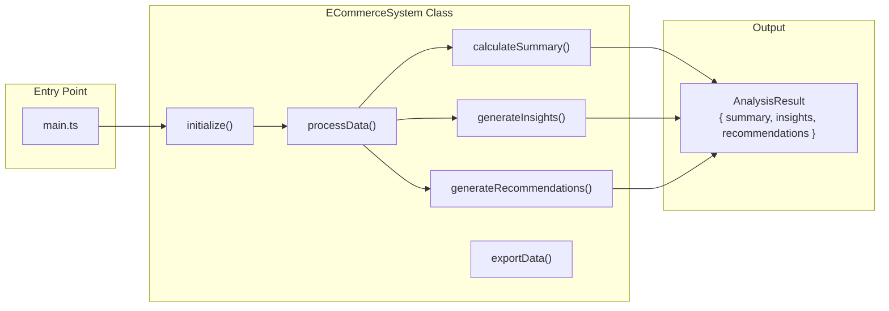
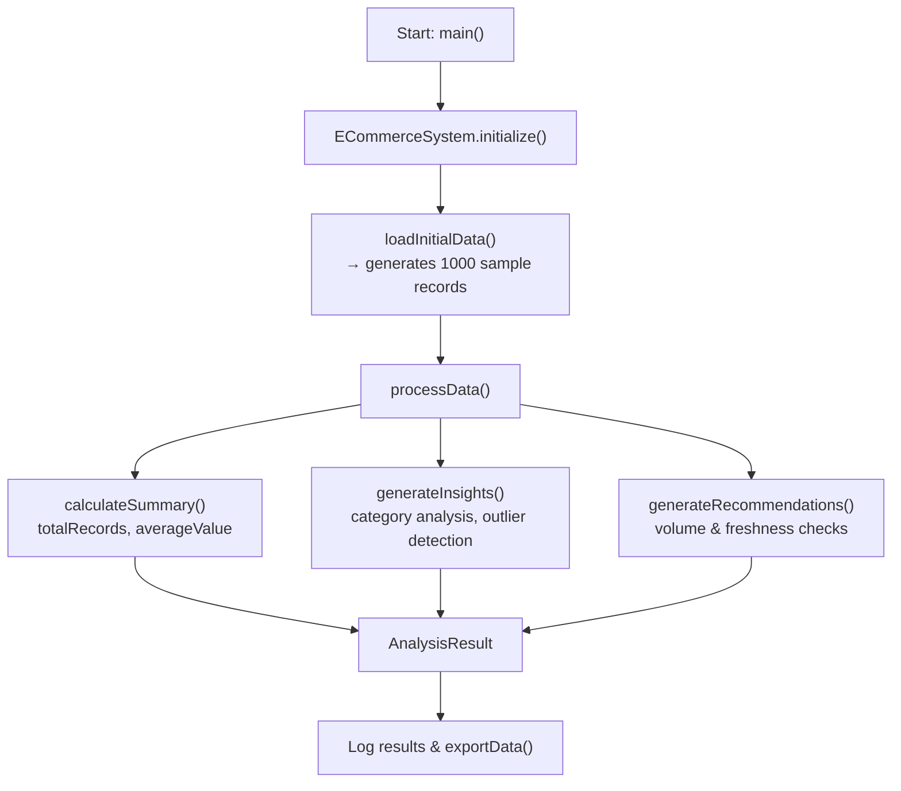

# E-Commerce Platform — TypeScript

[](https://www.typescriptlang.org/)
[](https://nodejs.org/)
[](https://opensource.org/licenses/MIT)

---

## 🇧🇷 Português

Plataforma de e-commerce desenvolvida em **TypeScript puro**, com arquitetura orientada a objetos, processamento de dados de pedidos, geração de insights e recomendações. Estruturada para ser expandida com APIs REST, banco de dados e frontend.

---

### 🏗️ Arquitetura do Sistema



---

### 🔄 Fluxo de Processamento de Dados



---

### 📐 Modelo de Dados



---

### 🚀 Tecnologias

| Tecnologia   | Versão | Função                          |
|--------------|--------|---------------------------------|
| TypeScript   | 5.x    | Linguagem tipada principal      |
| Node.js      | 18.x   | Runtime JavaScript/TypeScript   |
| ts-node      | latest | Execução direta de TypeScript   |

---

### ▶️ Início Rápido

```bash
# Clonar o repositório
git clone https://github.com/galafis/E-Commerce-Platform-TS.git
cd E-Commerce-Platform-TS

# Instalar dependências
npm install

# Compilar o projeto
npm run build

# Executar
npm start
```

---

### 📂 Estrutura do Projeto

```
E-Commerce-Platform-TS/
├── main.ts             # Classe ECommerceSystem + ponto de entrada
├── package.json        # Dependências e scripts npm
├── tsconfig.json       # Configuração TypeScript
├── dist/               # Código compilado (gerado pelo build)
└── README.md
```

---

### ⚡ Funcionalidades

- Inicialização configurável do sistema (batchSize, timeout, retryAttempts)
- Geração e processamento de registros de dados com tipagem forte
- Análise de categorias com detecção de registros de alto valor
- Recomendações automáticas com base no volume e atualidade dos dados
- Exportação de dados com metadata de auditoria (timestamp, versão, contagem)
- Tratamento de erros robusto em cada camada

---

### ✨ Melhorias Futuras

- Adicionar endpoints REST com Express ou Fastify.
- Integrar banco de dados (PostgreSQL com Prisma).
- Adicionar autenticação JWT e gerenciamento de usuários.
- Implementar carrinho de compras e checkout.
- Adicionar dashboard de analytics com gráficos.

---

### 📄 Licença

MIT License — sinta-se livre para usar, modificar e distribuir.

### 👨‍💻 Autor

**Gabriel Demetrios Lafis**
- GitHub: [@galafis](https://github.com/galafis)

---

---

## 🇬🇧 English

### E-Commerce Platform — TypeScript

E-commerce platform built in **pure TypeScript**, with object-oriented architecture, order data processing, insights generation, and recommendations. Structured to be extended with REST APIs, database integration, and frontend.

---

### 🏗️ System Architecture



---

### 🔄 Data Processing Flow



---

### 🚀 Getting Started

```bash
git clone https://github.com/galafis/E-Commerce-Platform-TS.git
cd E-Commerce-Platform-TS
npm install
npm run build
npm start
```

---

### ⚡ Features

- Configurable system initialization (batchSize, timeout, retryAttempts)
- Strongly-typed data record generation and processing
- Category analysis with high-value record detection
- Automatic recommendations based on data volume and freshness
- Data export with audit metadata (timestamp, version, record count)
- Robust error handling at every layer

---

### 🛠️ Tech Stack

| Technology | Role                      |
|------------|---------------------------|
| TypeScript | Strongly-typed language   |
| Node.js    | Runtime                   |
| ts-node    | Direct TypeScript execution |

---

### 📄 License

MIT License — feel free to use, modify, and distribute.

### 👨‍💻 Author

**Gabriel Demetrios Lafis**
- GitHub: [@galafis](https://github.com/galafis)

---

⭐ **If this project was helpful to you, consider leaving a star!**
