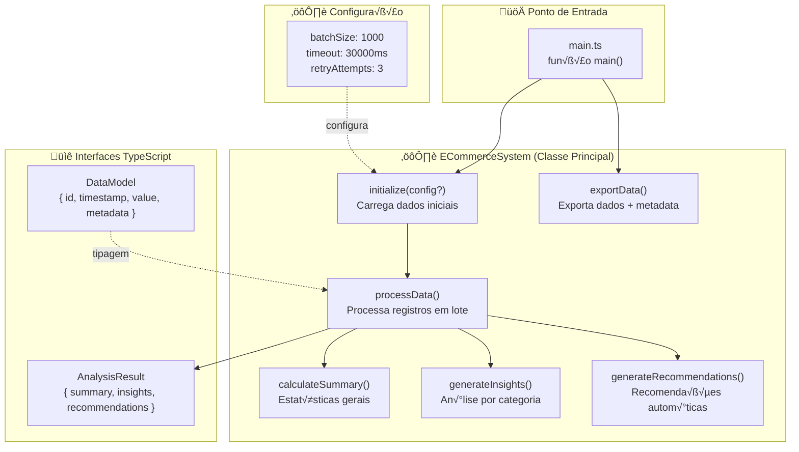
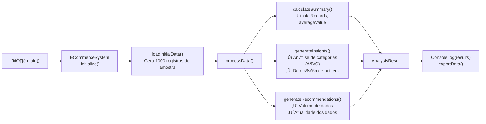
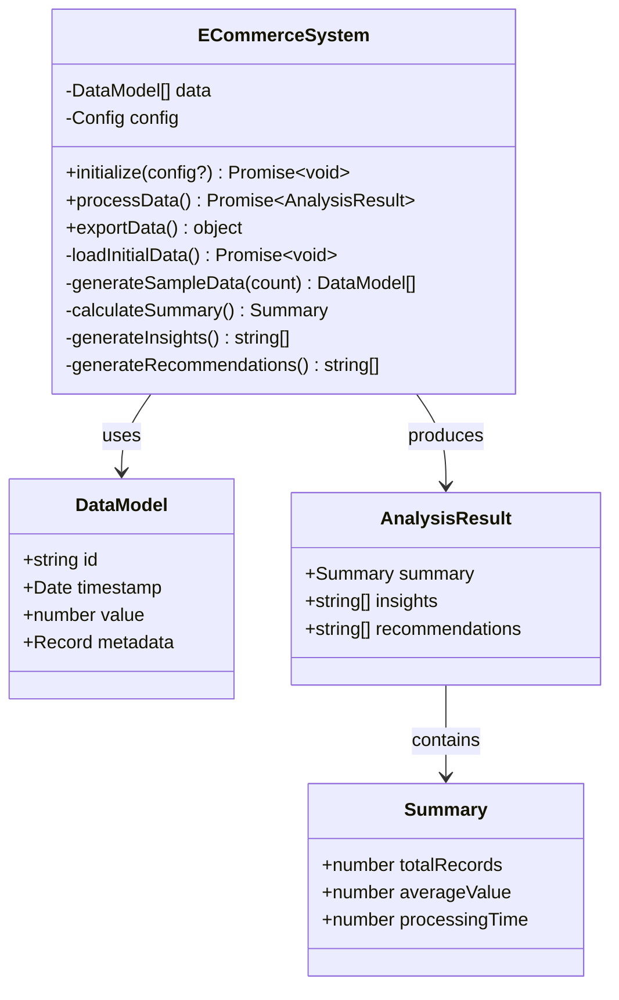
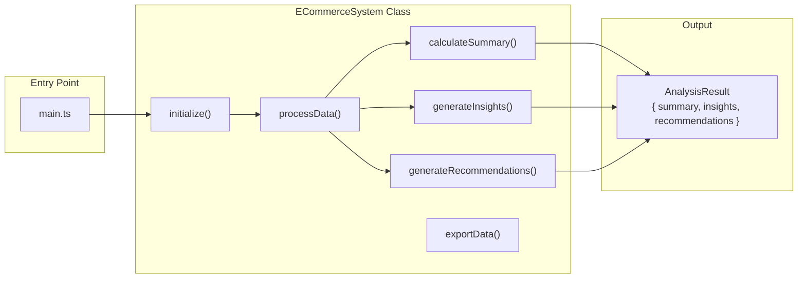
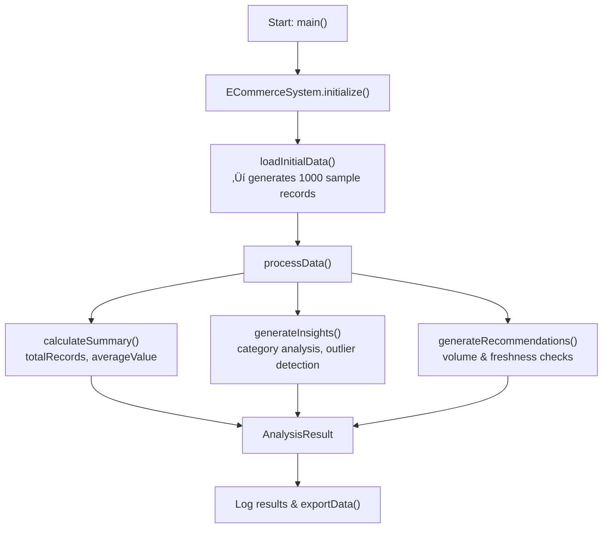

# E-Commerce Platform — TypeScript

[](https://www.typescriptlang.org/)
[](https://nodejs.org/)
[](https://opensource.org/licenses/MIT)

---

## 🇧🇷 Português

Plataforma de e-commerce desenvolvida em **TypeScript puro**, com arquitetura orientada a objetos, processamento de dados de pedidos, geração de insights e recomendações. Estruturada para ser expandida com APIs REST, banco de dados e frontend.

---

### 🏗️ Arquitetura do Sistema


```mermaid
graph TD
    subgraph Entry["üöÄ Ponto de Entrada"]
        MAIN["main.ts\nfunção main()"]
    end

    subgraph Core["⚙️ ECommerceSystem (Classe Principal)"]
        INIT["initialize(config?)\nCarrega dados iniciais"]
        PROC["processData()\nProcessa registros em lote"]
        CALC["calculateSummary()\nEstatísticas gerais"]
        INS["generateInsights()\nAn√°lise por categoria"]
        REC["generateRecommendations()\nRecomendações automáticas"]
        EXP["exportData()\nExporta dados + metadata"]
    end

    subgraph Models["üìê Interfaces TypeScript"]
        DM["DataModel\n{ id, timestamp, value, metadata }"]
        AR["AnalysisResult\n{ summary, insights, recommendations }"]
    end

    subgraph Config["⚙️ Configuração"]
        CFG["batchSize: 1000\ntimeout: 30000ms\nretryAttempts: 3"]
    end

    MAIN --> INIT
    INIT --> PROC
    PROC --> CALC
    PROC --> INS
    PROC --> REC
    PROC --> AR
    MAIN --> EXP
    DM -.->|"tipagem"| PROC
    CFG -.->|"configura"| INIT
```

---

### 🔄 Fluxo de Processamento de Dados


```mermaid
flowchart LR
    A["▶️ main()"] --> B["ECommerceSystem\n.initialize()"]
    B --> C["loadInitialData()\nGera 1000 registros de amostra"]
    C --> D["processData()"]
    D --> E["calculateSummary()\n‚Üí totalRecords, averageValue"]
    D --> F["generateInsights()\n→ Análise de categorias (A/B/C)\n→ Detecção de outliers"]
    D --> G["generateRecommendations()\n‚Üí Volume de dados\n‚Üí Atualidade dos dados"]
    E --> H["AnalysisResult"]
    F --> H
    G --> H
    H --> I["Console.log(results)\nexportData()"]
```

---

### üìê Modelo de Dados


```mermaid
classDiagram
    class DataModel {
        +string id
        +Date timestamp
        +number value
        +Record metadata
    }

    class AnalysisResult {
        +Summary summary
        +string[] insights
        +string[] recommendations
    }

    class Summary {
        +number totalRecords
        +number averageValue
        +number processingTime
    }

    class ECommerceSystem {
        -DataModel[] data
        -Config config
        +initialize(config?) Promise~void~
        +processData() Promise~AnalysisResult~
        +exportData() object
        -loadInitialData() Promise~void~
        -generateSampleData(count) DataModel[]
        -calculateSummary() Summary
        -generateInsights() string[]
        -generateRecommendations() string[]
    }

    ECommerceSystem --> DataModel : uses
    ECommerceSystem --> AnalysisResult : produces
    AnalysisResult --> Summary : contains
```

---

### üöÄ Tecnologias

| Tecnologia   | Versão | Função                          |
|--------------|--------|---------------------------------|
| TypeScript   | 5.x    | Linguagem tipada principal      |
| Node.js      | 18.x   | Runtime JavaScript/TypeScript   |
| ts-node      | latest | Execução direta de TypeScript   |

---

### ▶️ Início Rápido

```bash
# Clonar o repositório
git clone https://github.com/galafis/E-Commerce-Platform-TS.git
cd E-Commerce-Platform-TS

# Instalar dependências
npm install

# Compilar o projeto
npm run build

# Executar
npm start
```

---

### 📂 Estrutura do Projeto

```
E-Commerce-Platform-TS/
├── main.ts             # Classe ECommerceSystem + ponto de entrada
├── package.json        # Dependências e scripts npm
├── tsconfig.json       # Configuração TypeScript
├── dist/               # Código compilado (gerado pelo build)
└── README.md
```

---

### ‚ö° Funcionalidades

- Inicialização configurável do sistema (batchSize, timeout, retryAttempts)
- Geração e processamento de registros de dados com tipagem forte
- Análise de categorias com detecção de registros de alto valor
- Recomendações automáticas com base no volume e atualidade dos dados
- Exportação de dados com metadata de auditoria (timestamp, versão, contagem)
- Tratamento de erros robusto em cada camada

---

### ‚ú® Melhorias Futuras

- Adicionar endpoints REST com Express ou Fastify.
- Integrar banco de dados (PostgreSQL com Prisma).
- Adicionar autenticação JWT e gerenciamento de usuários.
- Implementar carrinho de compras e checkout.
- Adicionar dashboard de analytics com gr√°ficos.

---

### 📄 Licença

MIT License — sinta-se livre para usar, modificar e distribuir.

### 👨‍💻 Autor

**Gabriel Demetrios Lafis**
- GitHub: [@galafis](https://github.com/galafis)

---

---

## 🇬🇧 English

### E-Commerce Platform — TypeScript

E-commerce platform built in **pure TypeScript**, with object-oriented architecture, order data processing, insights generation, and recommendations. Structured to be extended with REST APIs, database integration, and frontend.

---

### 🏗️ System Architecture


```mermaid
graph LR
    subgraph Entry["Entry Point"]
        MAIN["main.ts"]
    end

    subgraph System["ECommerceSystem Class"]
        INIT["initialize()"]
        PROC["processData()"]
        CALC["calculateSummary()"]
        INS["generateInsights()"]
        REC["generateRecommendations()"]
        EXP["exportData()"]
    end

    subgraph Output["Output"]
        RES["AnalysisResult\n{ summary, insights, recommendations }"]
    end

    MAIN --> INIT --> PROC
    PROC --> CALC
    PROC --> INS
    PROC --> REC
    CALC & INS & REC --> RES
```

---

### 🔄 Data Processing Flow


```mermaid
flowchart TD
    A["Start: main()"] --> B["ECommerceSystem.initialize()"]
    B --> C["loadInitialData()\n‚Üí generates 1000 sample records"]
    C --> D["processData()"]
    D --> E["calculateSummary()\ntotalRecords, averageValue"]
    D --> F["generateInsights()\ncategory analysis, outlier detection"]
    D --> G["generateRecommendations()\nvolume & freshness checks"]
    E & F & G --> H["AnalysisResult"]
    H --> I["Log results & exportData()"]
```

---

### üöÄ Getting Started

```bash
git clone https://github.com/galafis/E-Commerce-Platform-TS.git
cd E-Commerce-Platform-TS
npm install
npm run build
npm start
```

---

### ‚ö° Features

- Configurable system initialization (batchSize, timeout, retryAttempts)
- Strongly-typed data record generation and processing
- Category analysis with high-value record detection
- Automatic recommendations based on data volume and freshness
- Data export with audit metadata (timestamp, version, record count)
- Robust error handling at every layer

---

### 🛠️ Tech Stack

| Technology | Role                      |
|------------|---------------------------|
| TypeScript | Strongly-typed language   |
| Node.js    | Runtime                   |
| ts-node    | Direct TypeScript execution |

---

### 📄 License

MIT License — feel free to use, modify, and distribute.

### 👨‍💻 Author

**Gabriel Demetrios Lafis**
- GitHub: [@galafis](https://github.com/galafis)

---

⭐ **If this project was helpful to you, consider leaving a star!**


---

## English

### Overview

E-Commerce Platform — TypeScript - A project built with JavaScript, TypeScript, Java, SQL, Node.js, developed by Gabriel Demetrios Lafis as part of professional portfolio and continuous learning in Data Science and Software Engineering.

### Key Features

This project demonstrates practical application of modern development concepts including clean code architecture, responsive design patterns, and industry-standard best practices. The implementation showcases real-world problem solving with production-ready code quality.

### How to Run

1. Clone the repository:
   ```bash
   git clone https://github.com/galafis/E-Commerce-Platform-TS.git
   ```
2. Follow the setup instructions in the Portuguese section above.

### License

This project is licensed under the MIT License. See the [LICENSE](LICENSE) file for details.

---

Developed by [Gabriel Demetrios Lafis](https://github.com/galafis)
